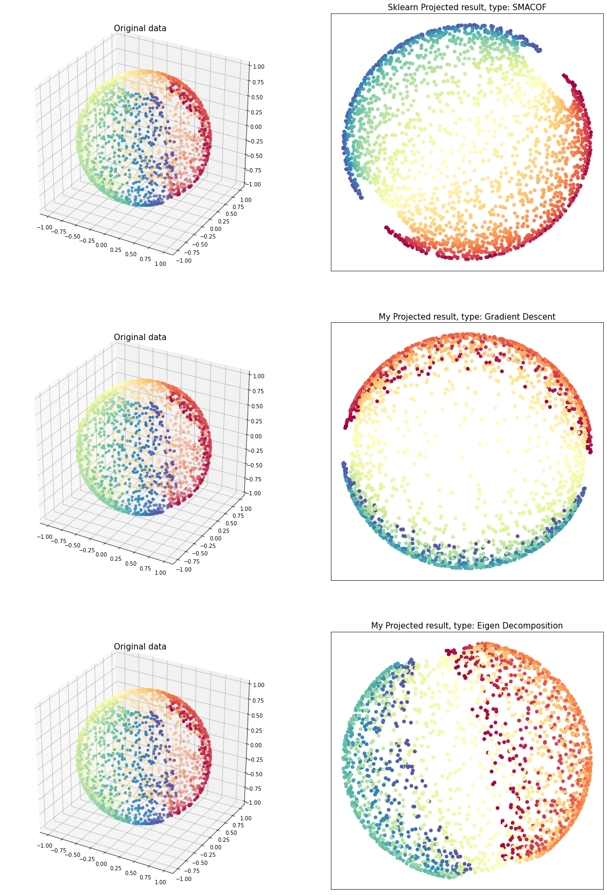
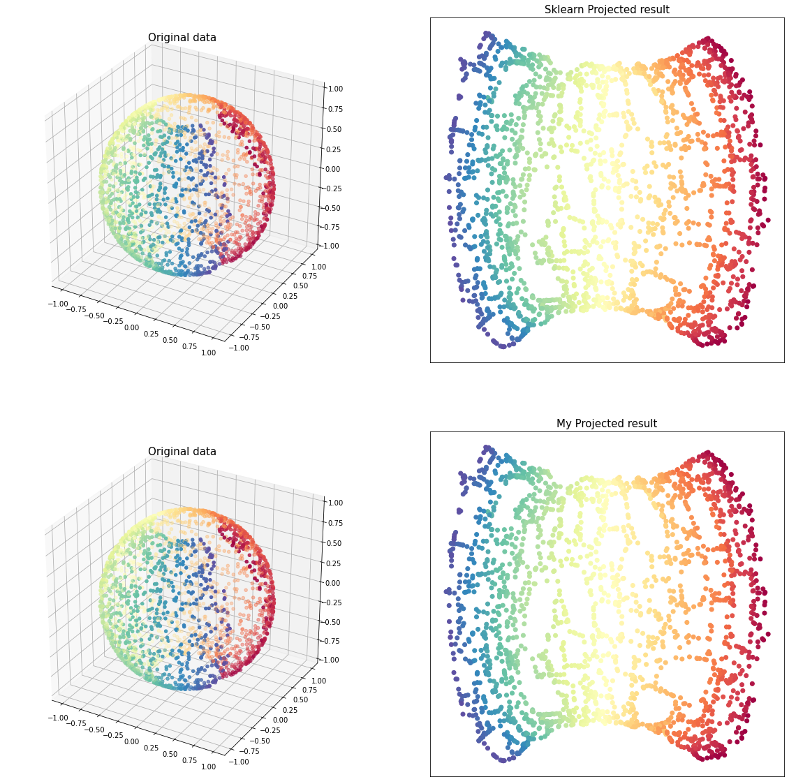
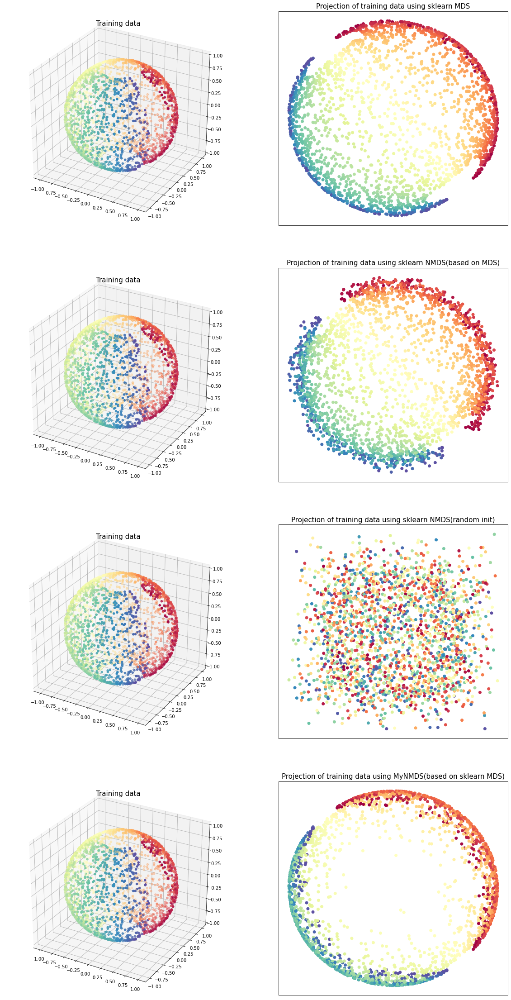
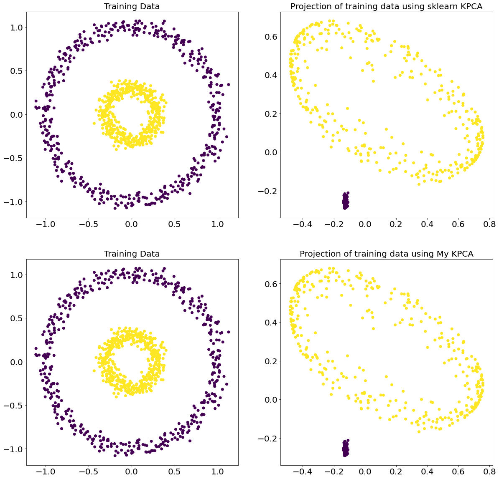

# dimensionality_reduction_python
Python implementation of some dimensionality reduction methods(PCA, LDA, LLE, NMDS, et al.)

基于python实现一些降维方法，包括算法原理、代码、案例以及参考资料

## ToDo List

- [x] PCA(Principal Component Analysis, 主成分分析)
- [x] FLD(Fisher's Linear Discriminant, Fisher线性判别, Fisher)
- [x] LLE(Locally Linear Embedding, 局部线性嵌入)
- [x] LE(Laplacian Eigenmap, 拉普拉斯特征映射)
- [x] PCoA(Principal Coordinates Analysis, 主坐标分析, Classical Multidimensional Scaling, 经典多维尺度分析)
- [x] ISOMAP(Isometric Mapping, 等距映射)
- [x] NMDS(Non-metric multidimensional scaling, 非度量多维尺度分析)
- [x] KPCA(Kernel Principle Component Analysis, 核主成分分析)
- [x] RP(random projection, 随机映射)
- [ ] Diffusion maps(Diffusion maps, 扩散映射)
- [ ] LLC(Locally Linear Coordination, 局部线性调和)
- [ ] Auto Encoder-Decoder
- [ ] SNE(Stochastic Neighbor Embedding)
- [ ] t-SNE(t-distributed stochastic neighbor embedding)
- [ ] UMAP(Uniform Manifold Approximation and Projection for Dimension Reduction, 基于一致流形逼近和投影的降维技术)
- [ ] LargeVis

## 对比

和sklearn等库中直接调用函数得到的结果进行对比

#### [PCA](./01_PCA/PCA.ipynb)

#### [FLD](./02_FLD/Fisher.ipynb)

#### [LLE](./03_LLE/LLE.ipynb)

#### [LE](./04_LE/LE.ipynb)

#### [PCoA](./05_PCoA/PCoA.ipynb)

#### [ISOMAP](./06_ISOMAP/ISOMAP.ipynb)

#### [NMDS](./07_NMDS/NMDS.ipynb)

#### [KPCA](./08_KPCA/KPCA.ipynb)

