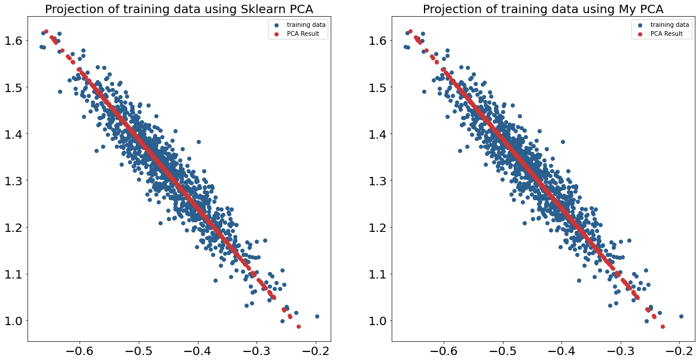
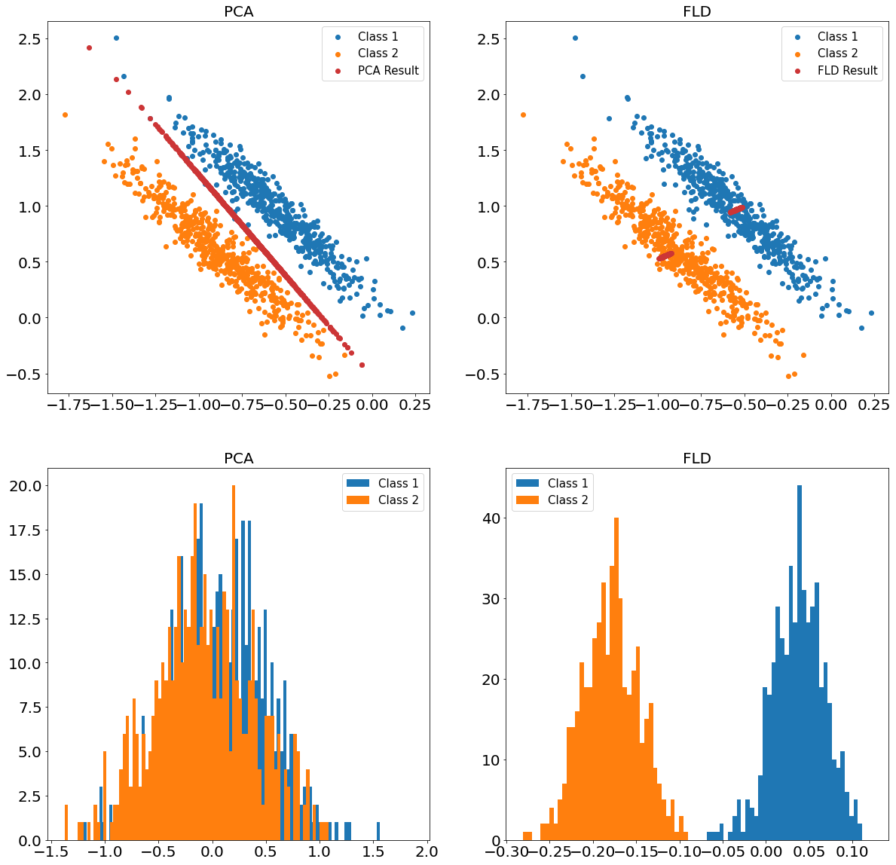
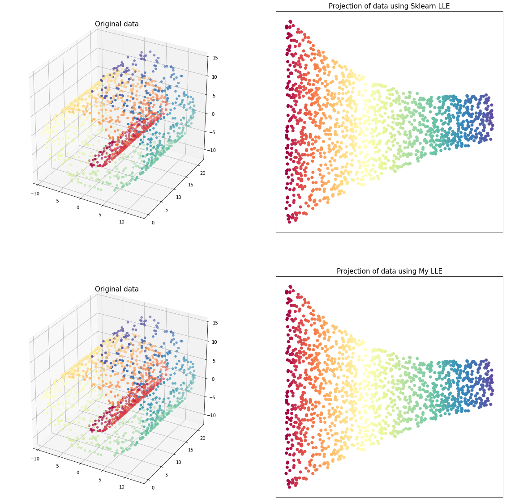
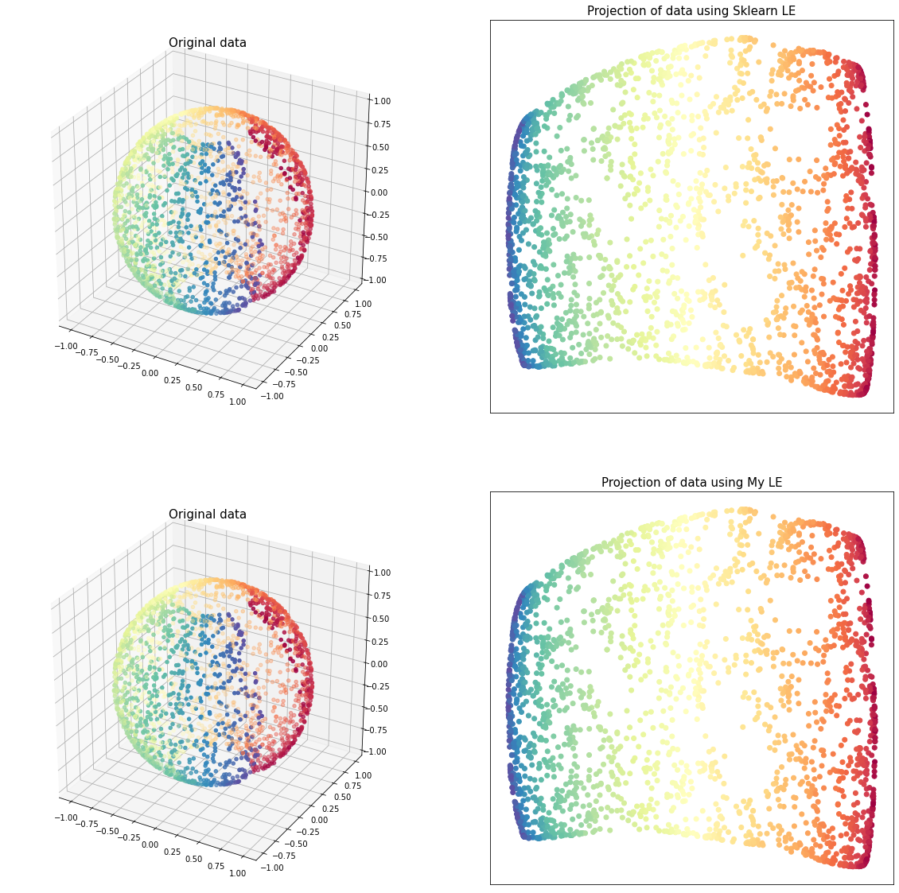

# dimensionality_reduction_python
Python implementation of some dimensionality reduction methods(PCA, LDA, LLE, NMDS, et al.)

基于python实现一些降维方法，包括算法原理、代码、案例以及参考资料

## ToDo List

- [x] PCA(Principal Component Analysis, 主成分分析)
- [x] FLD(Fisher's Linear Discriminant, Fisher线性判别, Fisher)
- [x] LLE(Locally Linear Embedding, 局部线性嵌入)
- [x] LE(Laplacian Eigenmap, 拉普拉斯特征映射)
- [ ] MDS(Multidimensional Scaling, 多维尺度分析)
- [ ] ISOMAP(Isometric Mapping, 等距映射)
- [ ] NMDS(Non-metric multidimensional scaling, 非度量多维尺度分析)
- [ ] SNE(Stochastic Neighbor Embedding)
- [ ] t-SNE(t-distributed stochastic neighbor embedding)
- [ ] UMAP(Uniform Manifold Approximation and Projection for Dimension Reduction, 基于一致流形逼近和投影的降维技术)
- [ ] PCoA(Principal Co-ordinates Analysis, 主坐标分析)
- [ ] PLS(partial least squares, 偏最小二乘回归)
- [ ] Auto Encoder-Decoder
- [ ] RP(random projection, 随机映射)

## 对比

和sklearn等库中直接调用函数得到的结果进行对比

#### [PCA](https://github.com/koolo233/dimensionality_reduction_python/blob/main/01_PCA/PCA.ipynb)

#### [FLD](https://github.com/koolo233/dimensionality_reduction_python/blob/main/02_FLD/Fisher.ipynb)

#### [LLE](https://github.com/koolo233/dimensionality_reduction_python/blob/main/03_LLE/LLE.ipynb)

#### [LE](https://github.com/koolo233/dimensionality_reduction_python/blob/main/04_LE/LE.ipynb)

